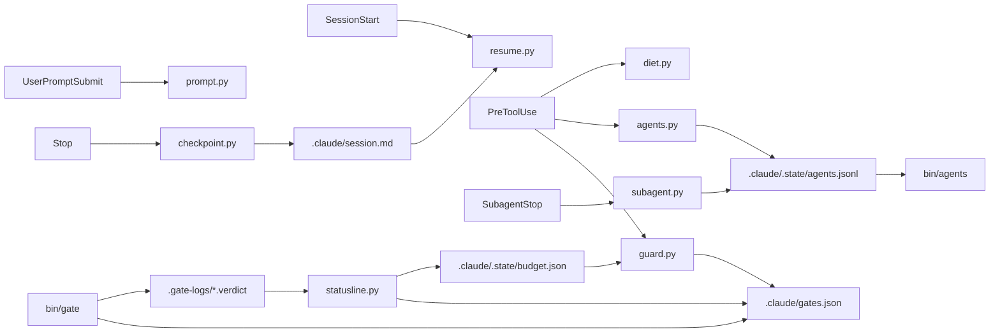

# claude-workbench

Brakes, gauges and a flight recorder for Claude Code: config-driven gates, a context guard, checkpoints and a subagent cost ledger.

<!-- demo.gif -->

  

## The problem

- A test or build run prints thousands of lines into the session, and none of it matters once it says PASS.
- A session drifts into reading forty files itself when a subagent could have read them and returned one paragraph.
- Nobody knows what delegating actually cost, so it gets argued about on feeling.

The workbench is a Claude Code plugin that deals with these three. Python standard library only, no dependencies.

## Quickstart

In Claude Code:

```
/plugin marketplace add mqa8668/claude-workbench
/plugin install workbench@claude-workbench
/init-workbench
```

`/init-workbench` reads your repository (package.json, mix.exs, pyproject.toml, Cargo.toml, go.mod, CI workflows), proposes the gates, writes `.claude/gates.json`, copies `bin/gate` and the status line into the repo, and runs the gates once to prove it works.

Then try it: ask Claude to run your test suite. The guard refuses the bare command and points at the wrapper:

```
That gate prints thousands of lines straight into this session. Run `bin/gate api` instead:
the full log goes to .gate-logs/ and you get the verdict. Read the failing part with `sed -n` on the log.
```

Do not install it into a repository that already wires the same hooks in its own `.claude/settings.json`. Both sets would fire.

### Try the gate runner without Claude Code

```
git clone https://github.com/mqa8668/claude-workbench
mkdir demo && cd demo && git init -q && mkdir -p .claude bin
cp ../claude-workbench/bin/gate bin/
cat > .claude/gates.json <<'JSON'
{ "tiers": [
  { "name": "web", "cmd": "echo 'built in 1.2s'", "summary": { "pass": ["built in [0-9.]+s"] } },
  { "name": "api", "cmd": "echo '2 passed, 1 failed'; exit 1", "summary": { "any": ["[0-9]+ passed.*"] } }
] }
JSON
python3 bin/gate
```

```
web     PASS  0m00s  built in 1.2s
api     FAIL  0m00s  2 passed, 1 failed
   full log: .gate-logs/api.log
not green - nothing ships.
```

The exit code is non-zero when any tier fails.

## What you get

| Piece | What it does |
|---|---|
| Gate runner, `bin/gate` | Runs each tier from `gates.json`, writes the full log to `.gate-logs/`, prints one line, leaves a verdict file. Can refuse when a port is up or down. |
| Context guard, `hooks/guard.py` | Refuses bare gate commands and whole-suite runs, nudges long investigations into subagents, brakes repeated rounds with one agent, refuses new fan-out when most of the five-hour window is spent. |
| Token diet, `hooks/diet.py` | Blocks a subagent spawn whose prompt lacks the diet block, and hands back the text to paste. |
| Checkpoint, `hooks/checkpoint.py` and `resume.py` | Rewrites `.claude/session.md` every turn and reads it back at session start, so `/clear` costs nothing. |
| Subagent ledger, `bin/agents` | One row per spawn, round and cost, summed from the agent's own transcript. |
| Context warning, `hooks/prompt.py` | One line to Claude above 200k tokens, a stronger one above 350k. |
| Status line, `statusline/statusline.py` | Directory, branch, model, five-hour usage, then gate verdicts and staleness, ports and live subagents. |
| Agents | `gate` (haiku), `scribe` (sonnet), `digger` (opus), `planner` and `reviewer` (inherit the session model). |

## How it works



One file, `.claude/gates.json`, says what "green" means for the repository. The runner, the guard and the status line all read it, so a tier added once shows up in all three. The hooks come from the plugin through `hooks/hooks.json`; the repository needs no hook entries of its own.

## Configuration: `gates.json`

```json
{
  "force_env": ["GATE_FORCE"],
  "cheap_agents": ["gate"],
  "tiers": [
    {
      "name": "web",
      "dir": "web",
      "cmd": "npm run build",
      "watch": ["web/"],
      "guard": ["\\bnpm\\s+run\\s+build\\b"],
      "summary": {
        "pass": ["built in [0-9.]+m?s"],
        "fail": { "count": "error TS", "as": "{n} tsc errors" },
        "default": "typecheck, build"
      }
    },
    {
      "name": "server",
      "dir": "server",
      "cmd": "ruff check . && pytest -q",
      "watch": ["server/"],
      "requires_port": [
        { "port": 5432, "why": "nothing is on :5432, so the database tests would not run.",
          "hint": "docker compose up -d db" }
      ],
      "summary": { "any": ["[0-9]+ passed.*", "[0-9]+ failed.*"], "default": "lint, tests" }
    }
  ],
  "checks": [],
  "ports": [[5173, "5173", "react"], [5432, "5432", "store"]],
  "deny": []
}
```

| Key | Meaning |
|---|---|
| `tiers[].cmd`, `dir` | What to run and where. |
| `tiers[].watch` | Paths whose being written after the last verdict make that verdict stale. |
| `tiers[].guard` | Regexes for the bare command this tier replaces. The guard refuses them and names `bin/gate <tier>`. |
| `tiers[].summary` | How to get one line out of the log. `any` is tried always, `pass` and `fail` only on their outcome, `count` reports how many times a string appears. |
| `tiers[].requires_port`, `refuses_port` | Refuse to run when a port is down, or up. |
| `checks` | Things you run by hand that still leave a verdict behind. |
| `ports` | What the status line watches, as `[port, label, glyph]`. |
| `deny` | Other bare commands to refuse, as `{ "match": regex, "say": message }`. |
| `cheap_agents` | Agents the five-hour brake lets through even on a spent window. Default `["gate"]`. |
| `force_env` | Environment variable names that override a refusal, for example `GATE_FORCE=1 bin/gate api`. |

A `gates.json` that is present but broken is reported loudly. A guard that stops guarding without saying so is the failure it cannot have.

## Status line

Claude Code runs whatever `statusLine` names in settings.json. `/init-workbench` copies the host and the segments into `.claude/hooks/` and offers to add this to `.claude/settings.json`:

```json
{
  "statusLine": { "type": "command", "command": "python3 .claude/hooks/statusline.py" }
}
```

The line looks like this:

```
myrepo  main*  Opus  5h 41%  gate 12m  e2e stale  5173 5432
```

Without a status line the guard's five-hour brake has nothing to read, because Claude Code only hands the rate-limit figure to the status line. Set `NO_COLOR=1` for plain text. If you already have a status line script, import `templates/statusline-extra.py` and call `segments(payload, colours)` from it.

## Sample outputs

The guard, when a bare gate command is run:

```
That gate prints thousands of lines straight into this session. Run `bin/gate api` instead: ...
```

The ledger, with `bin/agents`, lists each agent spawned in the session with its model, turns and token cost, and reports where the day's delegation went.

## Design principles

- **Machinery, not law.** It holds gates, a guard, a checkpoint and a ledger. It holds no opinion about how your product should be built. There is deliberately no CLAUDE.md, no build agent and no review process in the package. Those rules come from failures in a specific project, and carrying them to one that has not had the failure just adds context to every turn.
- **Every brake says what to do instead**, in a form that runs, and fires once. A guard that keeps refusing gets switched off.
- **The figures are measured.** Where a comment in the code quotes a number, it was measured on my own projects. Treat the numbers as a starting point for your own measurement.

## Testing

```
bin/selftest
```

47 checks, no network, no fixtures. Each one builds a throwaway git repository, writes the config it wants, and runs the package's own files against it the way Claude Code would. The suite exists to catch the failure that installs cleanly and does nothing: a hook wired to a path that moved, an agent with no model pinned, a guard reading a list it no longer has.

Writing the checks found five defects. Two while the suite was first written: the runner printed a hundred characters of shell as a tier's summary line, and the package still named the repository it came from. Three more from a review pass. The worst was that the guard stopped guarding, silently, when its config was broken. The other two: the force switch had widened to skip a port requirement as well as a refusal, and two runs of one tier shared a log and a verdict, so the second truncated the first.

## Requirements and limits

- Python 3.9 or newer, and git.
- macOS or Linux. The runner uses `fcntl`, so Windows is not supported.
- A Claude Code version with plugin support.

## Roadmap

- Project sync: an opt-in, throttled fast-forward of the working tree from the remote for people who run several sessions on one repository, with the list of "do not move files under me" processes taken from `gates.json`.
- Example projects and ready-made `gates.json` files for common stacks.
- A recorded demo.

## Contributing

See [CONTRIBUTING.md](CONTRIBUTING.md).

## License

MIT, see [LICENSE](LICENSE). Built by Loc Luong, DevOps and backend engineer, [github.com/mqa8668](https://github.com/mqa8668).

Not affiliated with Anthropic.
